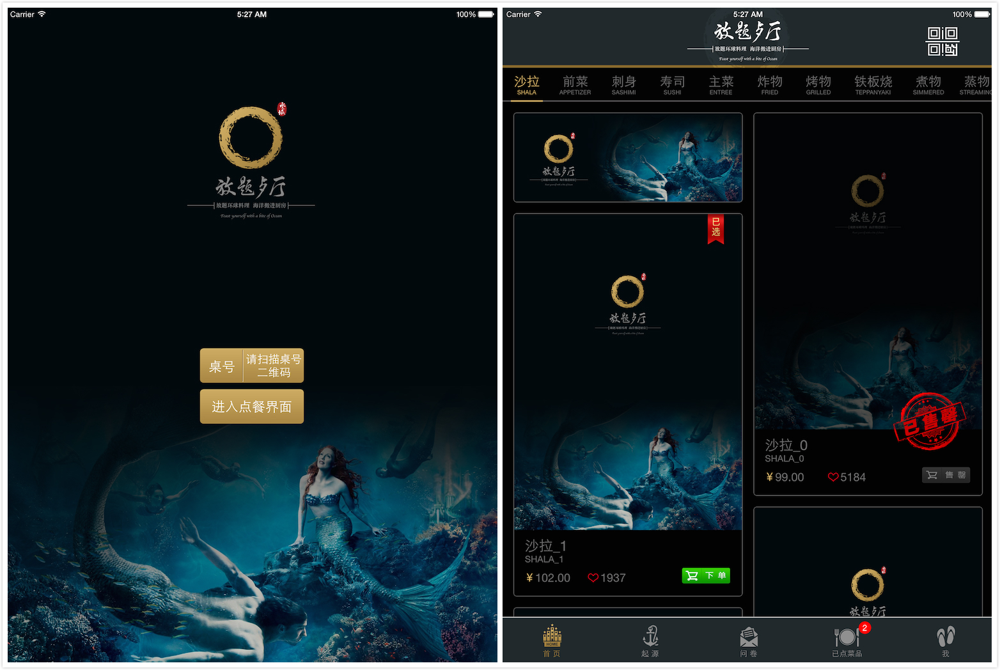
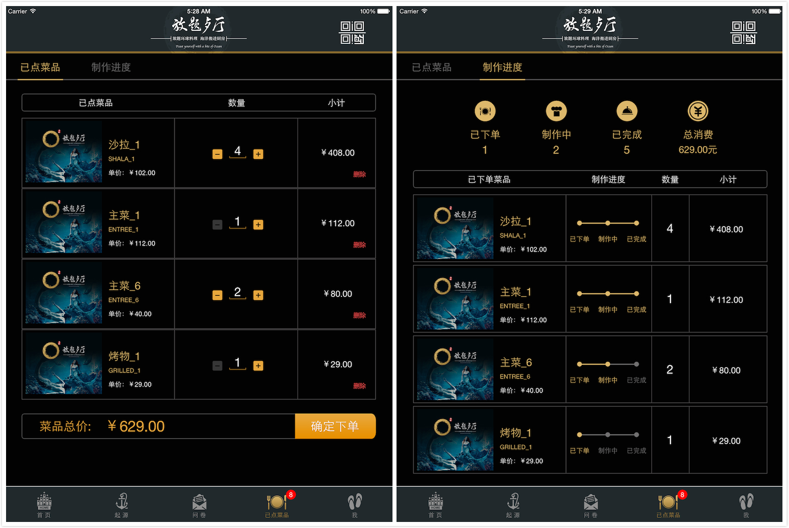
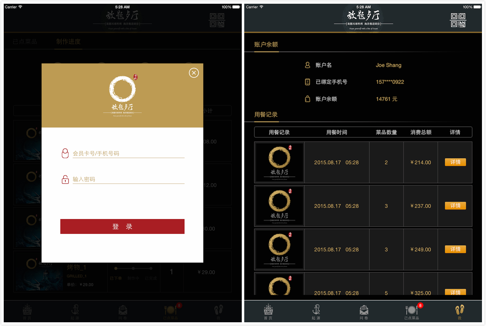

# 炉火餐饮系统 iPad 点餐端

## 项目背景

炉火餐饮系统是我于2014年8月至10月期间合作完成的一个外包项目，整个 iPad 点餐端是我负责完成的。当时接手这个项目时根本没有把它当成外包来做，是当成创业在做，经过调研，觉得市面上很多 iPad 点餐系统非常丑陋、难用，根本达不到主流 App 的审美，也不配在 iPad 这种工艺品硬件上运行。对于工程师而言，与其抱怨，不如打开 Xcode，来一次 Write the Code，Change the World，做出一款优秀的点餐系统来！所以当我看到效果图的时候，虽然觉得钱少不太好短时间做出来，还是决定实现它。刚开始的一个月进展缓慢，有些效果不知道怎么做出来，找到的第三方控件要么不满足要求，要么有 bug（难以修改），那段时间恰巧是校招的黄金期，看着同学面试拿 offer，我还在不分日夜的写代码，没有收入没有未来，焦虑，头发大把大把的掉。后来静下心来，看懂一些控件的实现原理，自己自定义控件来满足需求，把一些难点突破了之后，进度突飞猛进，9月底完成了整个 UI 部分。在之前需求沟通时，我观察到客户非常注重界面效果，为了减少需求理解误差，我给数据管理模块提供了测试数据，验证 UI 显示效果与流程，将 UI 体验版放到了蒲公英的公测平台上，让客户下载体验，提出反馈意见，效果很不错（这时候也理解了敏捷强调及时反馈的原因）。完成 UI 之后，就是同后端进行对接，在这个过程中，问题出现了，那就是如何联调测试？每次测试业务流程都需要人工联调，低效且不全面，也很难回归，很多 bug 没有暴露出来，直到去部署时才发现，非常被动。直到真正痛过，才意识到单元测试、自动化测试、TDD 不是理想化，而是能够解决痛点的良药（虽然一开始良药苦口），当时甚至觉得越是小团队人力不足，越需要自动化进行弥补。

最后，这个项目虽然上线了，但是签的合同有问题，没有验收标准没有验收时间，客户在部署后还在不断要求改需求加需求（关键是本来项目钱很少，还不加钱啊），根本没法在做下去了，我们在程序里也没有加任何的限制性措施（还是图样图森破啊），最终不了了之，占整个项目金额一半多的尾款也没给我们。人生总有许多不如意的地方，谁想到开豪车住别墅开高档餐厅的客户会这个样子，我总想把代码写好，把东西弄出来，反而没注意到合同的漏洞，三个月辛苦，还耽误了校招，就换回来一个 Macbook Pro 还有这个 App。。。我觉得，既然这个 App 我用心做了，不如将它开源出来吧，也算是对自己努力的一种慰藉吧。

> 莫忘初心，但行好事，去他妈的前程！

## 项目特点

1. 支持主题管理。当时的想法不是只做一家餐厅，而是希望做成模板化，因此将一些 UI 资源抽象成主题，以后可以通过替换主题实现不同餐厅界面的定制需求。具体原理我写了一篇文章，[主题更换的实现思路](http://joeshang.github.io/2014/12/22/theme-change-architecture/)。
2. 清晰的架构与设计。
  - 尽量避免重复，保持 DRY。根据 SRP，明确职责，拆成多个类，避免超级类。
  - 利用 KVO 实现数据与显示的解耦。利用状态机在不同数据情况下显示不同内容。
3. 整洁的代码风格。对于重度代码洁癖和处女座的我来说，多一个或少一个空格都让我难受，所以我尽力让自己的代码整洁干净，Git 提交历史清晰准确。工艺品之所以为工艺品，就是在细节上做到了极致，我认为代码也是一样，注重细节的代码其他地方也不会差。

半年过去了，自己看了《Effective Objective-C 2.0》、《编写可读代码的艺术》之后觉得代码里有许多地方都需要重构，不过当时的我确实尽了自己最大的努力，还是有值得一看的地方的。觉得之前代码需要改进才说明自己有进步，Stay Hungry，Stay Foolish 不是一句空话。

效果图如下：

菜单界面

订单界面

会员界面

## 如何使用

iPad 点餐端需要连接局域网内的 Web Services 才能正常工作，这一块的代码不在我这里，因此无法开源。但在实现 iPad 点餐端的时候，由于客户是界面效果优先的思维，为了减少需求沟通过程中导致的理解偏差，我先实现了可以脱机运行的 UI 体验版，使用一些测试数据，供客户体验 App 的整个交互流程，提出修改意见，在修正后再接的后端。因此，在没有后端的情况下，也可以通过 UI 体验版来使用 iPad 点餐端。

打开 UI 体验版的方法：将 `SFCommonHeader.h` 中的 `SF_UI_TEST` 宏打开重新运行即可。在进行会员登录时，用户名与密码随意输入字符都能进入会员界面（但不能为空）。

## 一些说明

### 界面相关

- 为了一些界面效果，实现了自定义控件：[SCRScrollMenuController](https://github.com/joeshang/SCRScrollMenuController)、[CRTabBar](https://github.com/joeshang/CRTabBar)、[CRModal](https://github.com/joeshang/CRModal)。
- 由于界面不算复杂，因此 UI 的构建基本上使用的是 Interface Builder。
- 由于项目需求的原因，只运行在 iPad 上，因此并没有使用 AutoLayout 与 SizeClass，也不支持横屏。

### 网络相关

- Web Services 是 .NET 实现的 SOAP 风格（看到 `SFCommandHeader.h` 中 `http://192.168.1.2/webservice.asmx` 就知道啦），并不是 REST 风格的。由于 iOS 中 SOAP 的库不太好找，这里使用的是 HTTP Method 的方式，将数据打包成 JSON 格式（为了方便将 JSON 转成 Object），塞到 SOAP 返回的 XML 中，因此需要将数据解析两次，看起来怪怪的。
- 由于是在项目后期接入的后端，有些赶工期，网络处理部分并没有好好设计，没有抽出网络模块，导致网络通信同业务逻辑之间并没有很好的解耦，如果想将 Web Services 从 SOAP 更换成 REST，并不能很方便的切换。关于网络相关的架构设计，可以参考[田伟宇](http://weibo.com/casatwy)大神的[iOS应用架构谈 网络层设计方案](http://casatwy.com/iosying-yong-jia-gou-tan-wang-luo-ceng-she-ji-fang-an.html)。
